<h1>Olá, eu sou Bernardo Wehmuth 👋</h1>

Desenvolvedor Full-stack · Jaraguá do Sul, Brasil

---

### Sobre mim

Desenvolvedor full-stack apaixonado por construir produtos completos, do banco de dados à interface. 
Gosto de código limpo, boas arquiteturas e aplicações que resolvem problemas reais.

🔭 Atualmente trabalhando na **GeoVendas** 
🌱 Aprendendo **React · Java · Spring · Docker · JavaScript · TypeScript** 

---

### Tech stack

**Front-end**

**Back-end**

**Banco de dados**

**DevOps**

---

### Estatísticas

---

### Contato

